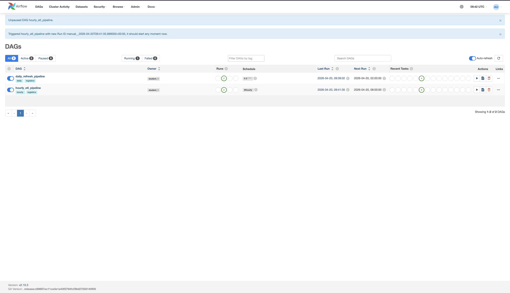
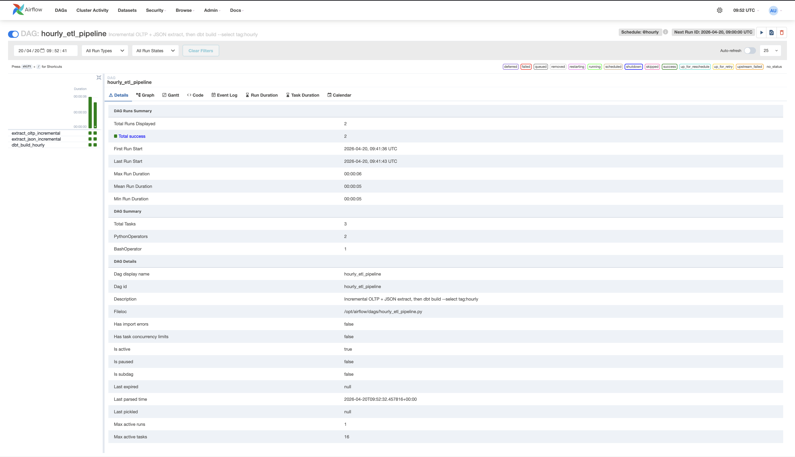
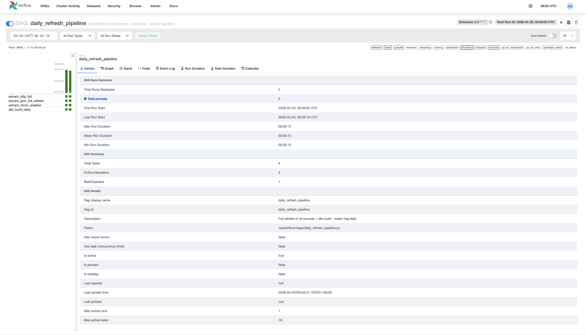
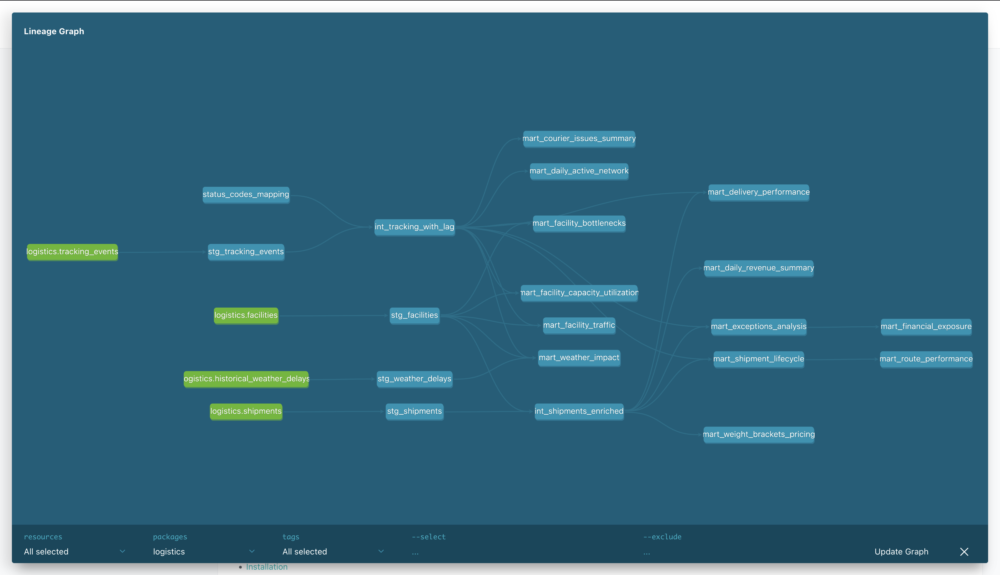
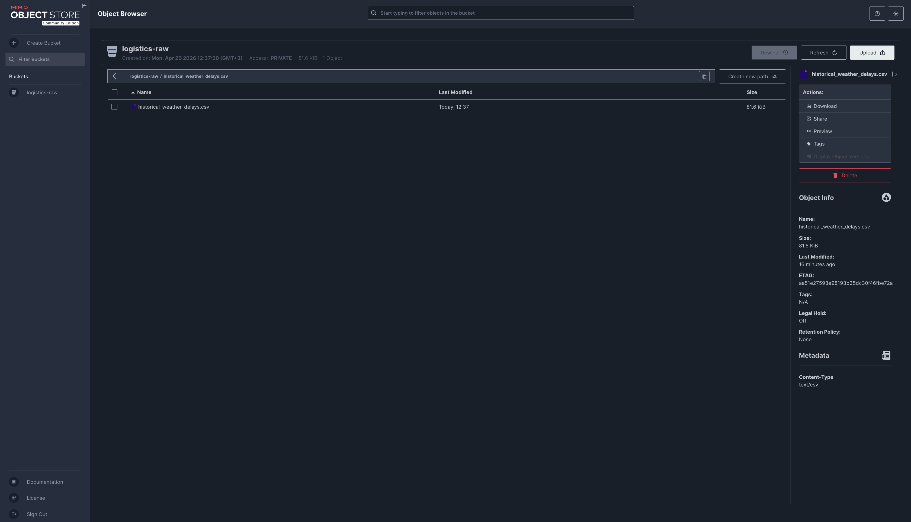
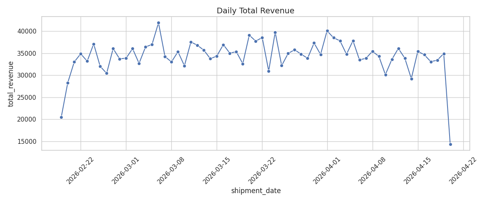
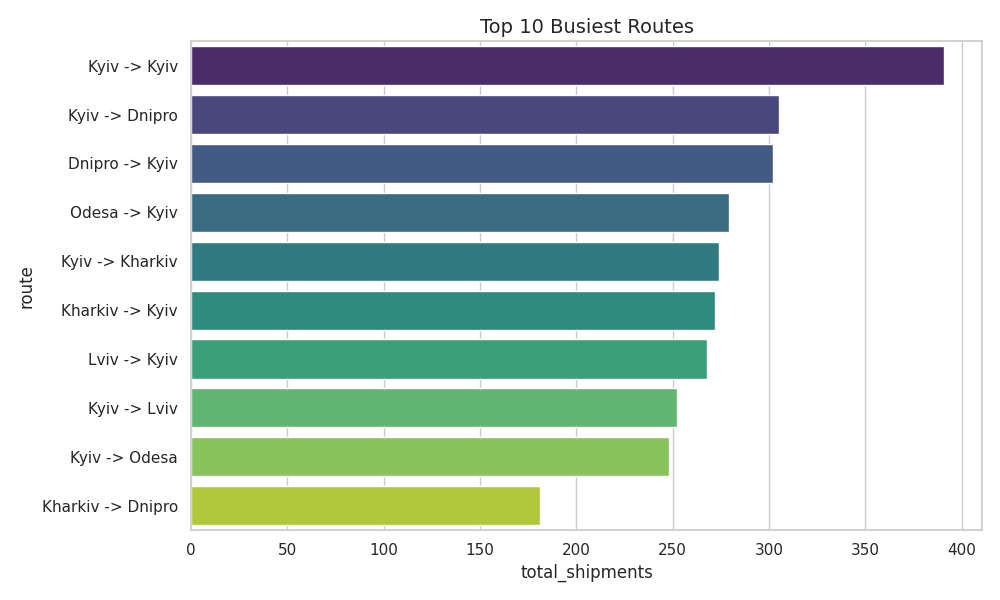
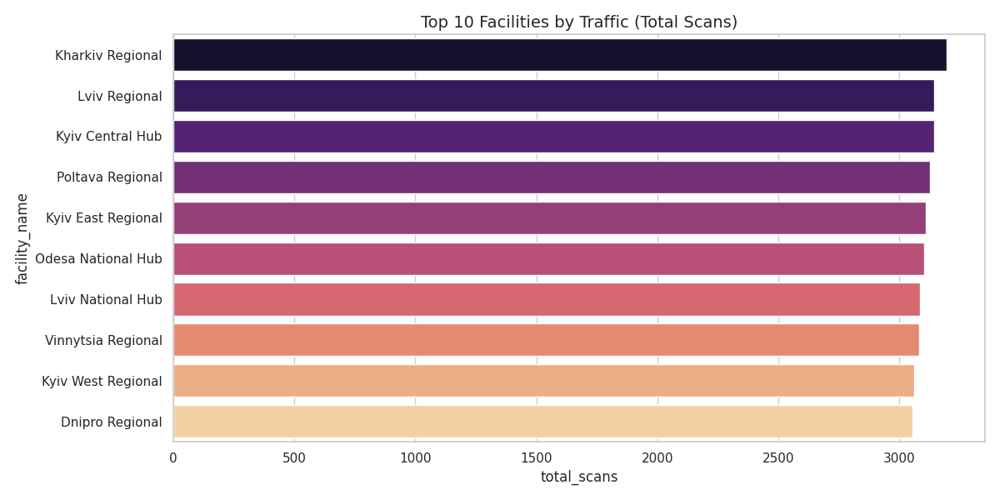
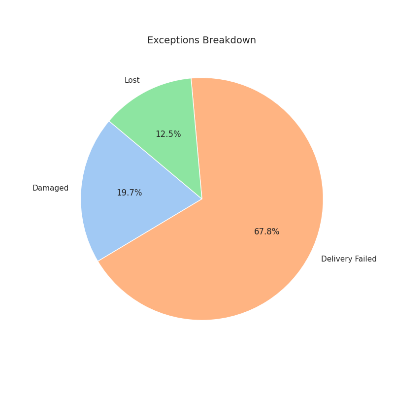
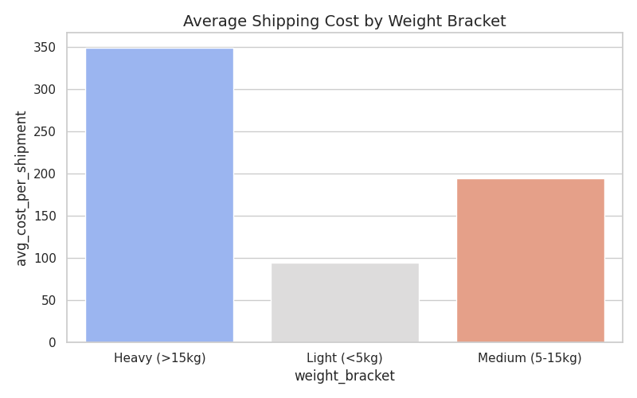

# Logistics Analytics — AI340 Final Project

End-to-end analytics stack for a logistics domain (shipments, tracking events,
facilities). Built for the AI340 Assignment #3.

- **Yuliia Martynova** ETL pipelines, Airflow orchestration, DuckDB warehouse, MinIO.
- **Anna Nechytailenko** dbt project

## Architecture

```
PostgreSQL (OLTP)  ─┐
JSON event logs    ─┼──►  Python ETL (Pandas/Polars)  ──►  DuckDB  ──►  dbt  ──►  marts
MinIO (large CSV)  ─┘                                      ▲
                                                           │
                                              Airflow orchestrates both
                                              (hourly + daily DAGs)
```

## Project layout

```
.
├── dags/                 # Airflow DAGs (Stage 5)
├── etl/                  # Python ETL scripts (Stage 4)
├── scripts/              # One-off helpers: data generation, MinIO seeding
├── sql/                  # PostgreSQL init scripts (run on first container start)
├── data/
│   ├── raw/events/       # Generated JSON tracking events
│   └── warehouse/        # DuckDB file (logistics.duckdb)
├── dbt_project/          # Student 2's dbt project (mounted into Airflow)
├── docker-compose.yml
├── requirements.txt      # Local dev / notebooks
└── .env.example
```

## Services (ports on the host)

| Service            | Port        | URL / note                            |
| ------------------ | ----------- | ------------------------------------- |
| Airflow webserver  | 8080        | http://localhost:8080 (admin/admin)   |
| PostgreSQL (OLTP)  | 5433        | host `localhost`, db `logistics`      |
| PostgreSQL (meta)  | internal    | Airflow metadata store only           |
| MinIO S3 API       | 9000        | for clients (boto3, `minio` sdk)      |
| MinIO console      | 9001        | http://localhost:9001 (minioadmin)    |

## First-time setup

```bash
cp .env.example .env
docker compose up airflow-init   # one-time: migrate DB + create admin user
docker compose up -d             # start everything
```

Then open:
- Airflow — http://localhost:8080 (admin / admin)
- MinIO — http://localhost:9001 (minioadmin / minioadmin)

## Stop / reset

```bash
docker compose down          # stop containers, keep data
docker compose down -v       # stop AND wipe volumes (fresh start)
```

## Populating the OLTP database (Stage 2)

After `docker compose up -d` the `facilities` and `shipments` tables exist but
are empty. Fill them with:

```bash
# from the host (needs Python + requirements.txt installed)
pip install -r requirements.txt
python scripts/generate_oltp_data.py

# OR from inside the Airflow container (no local Python needed)
docker compose exec airflow-scheduler python /opt/airflow/scripts/generate_oltp_data.py
```

Defaults: 24 facilities, 10_000 shipments spread over 60 days. Override via env:
`N_SHIPMENTS=50000 DAYS_OF_HISTORY=90 python scripts/generate_oltp_data.py`.

The script TRUNCATEs both tables first, so it's safe to re-run.

## Generating tracking events (Stage 3)

Once shipments exist in Postgres, simulate tracking-event logs:

```bash
python scripts/generate_tracking_events.py
```

For each shipment the script picks a realistic lifecycle
(normal delivery / failed attempt / delayed / damaged / lost) and emits events
with timestamps. The output lives in `data/raw/events/events_YYYY-MM-DD_HH.json`
— one file per hour, so the hourly Airflow DAG (Stage 5) can process just the
newest file incrementally.

Status codes emitted: 10/20/30/35/40/50/60/70/80. The matching human-readable
names live in Student 2's dbt seed `status_codes_mapping.csv`.

## ETL into DuckDB (Stage 4)

All scripts live under `etl/` and write to `data/warehouse/logistics.duckdb`
under the `raw` schema — that's what Student 2's dbt sources point at.

| Script                     | Target table                          | Mode                                          |
| -------------------------- | ------------------------------------- | --------------------------------------------- |
| `etl.extract_oltp`         | `raw.facilities`, `raw.shipments`     | full by default; `INCREMENTAL=1` for shipments|
| `etl.extract_json`         | `raw.tracking_events`                 | incremental; `FULL_REFRESH=1` to wipe & reload|
| `etl.extract_minio`        | `raw.historical_weather_delays`       | full replace (+2.5 bonus)                     |

Run locally:

```bash
python -m etl.extract_oltp               # full load
INCREMENTAL=1 python -m etl.extract_oltp # only new shipments since last run

python -m etl.extract_json               # picks up only new hourly JSON files
FULL_REFRESH=1 python -m etl.extract_json

# MinIO bonus: seed the bucket once, then extract
python scripts/seed_minio.py             # generates weather CSV and uploads
python -m etl.extract_minio
```

Incremental logic:
- `extract_oltp` reads `MAX(created_at)` from `raw.shipments` and fetches only newer rows.
- `extract_json` tracks already-ingested filenames in `raw._ingested_files`.

## Airflow DAGs (Stage 5)

Two DAGs live in `dags/`:

### `hourly_etl_pipeline` — every hour at :00

```
extract_oltp_incremental
    → extract_json_incremental
        → dbt build --select tag:hourly
```

Fast, incremental: picks up only new shipments (by `MAX(created_at)`) and new
JSON files (tracked in `raw._ingested_files`), then rebuilds dbt models tagged
`hourly` (typically staging + time-sensitive KPIs).

### `daily_refresh_pipeline` — every day at 02:00 UTC

```
extract_oltp_full
    → extract_json_full_refresh
        → extract_minio_weather
            → dbt build --select tag:daily
```

Heavier: full replace on all raw tables, MinIO weather ingest, then rebuilds
mart models tagged `daily` (trend analyses, SLA aggregations, bottleneck
reports). Runs sequentially because DuckDB is a single-writer database; the
02:00 slot is deliberately offset from the hourly DAG.

### DAG safety features
- `max_active_runs=1` — no DAG can overlap with itself
- `retries=1` with 5–10 min delay
- `catchup=False` — no backfill when the DAG is first unpaused
- Both DAGs skip the `dbt build` step gracefully if `dbt_project.yml` doesn't
  exist yet (so Student 1 can work on the pipeline before Student 2's models
  are ready).

### Expected startup sequence
```bash
docker compose up -d
python scripts/generate_oltp_data.py          # seed OLTP
python scripts/generate_tracking_events.py    # seed JSON logs
python scripts/seed_minio.py                  # seed MinIO bucket (bonus)
# Open http://localhost:8080 and unpause both DAGs
```


## Testing the pipeline , requires Docker)

```bash
cp .env.example .env
docker compose up airflow-init
docker compose up -d

# populate sources
ocker compose exec airflow-scheduler python /opt/airflow/scripts/generate_oltp_data.py
docker compose exec airflow-scheduler python /opt/airflow/scripts/generate_tracking_events.py
docker compose exec airflow-scheduler python /opt/airflow/scripts/seed_minio.py

# run the ETL
docker compose exec airflow-scheduler python -m etl.extract_oltp
docker compose exec airflow-scheduler python -m etl.extract_json
docker compose exec airflow-scheduler python -m etl.extract_minio

# inspect DuckDB
docker compose exec airflow-scheduler python -c "import duckdb; c=duckdb.connect('/opt/airflow/data/warehouse/logistics.duckdb'); print(c.execute(\"SELECT table_schema, table_name FROM information_schema.tables WHERE table_schema='raw'\").fetchall())"

```


OR
```bash

cp .env.example .env
docker compose up -d
  # populate sources                                                                                                                                
    make populate-sources

  # run the ETL - optional cause dag do this underhood 
    make run-etl

  # inspect DuckDB
    make inspect-db
    
    make inspect-raw-db

    make inspect-main-db

  # command to include docker compose down -v + clean all local generated files
    make down-all


  ```


## Database Schema Report

## 1. Raw Schema (`raw`)
This schema contains the initial ingested data from our sources.

### `_ingested_files`
* `file_name` (VARCHAR)
* `row_count` (INTEGER)
* `ingested_at` (TIMESTAMP)

### `facilities`
* `facility_id` (BIGINT)
* `facility_name` (VARCHAR)
* `facility_type` (VARCHAR)
* `city` (VARCHAR)
* `max_capacity_per_day` (BIGINT)

### `historical_weather_delays`
* `date` (DATE)
* `city` (VARCHAR)
* `weather_condition` (VARCHAR)
* `precipitation_mm` (DOUBLE)
* `regional_delay_flag` (BOOLEAN)

### `shipments`
* `shipment_id` (VARCHAR)
* `sender_id` (BIGINT)
* `origin_facility_id` (BIGINT)
* `destination_facility_id` (BIGINT)
* `weight_kg` (DECIMAL(4,2))
* `declared_value` (DECIMAL(6,2))
* `shipping_cost` (DECIMAL(5,2))
* `created_at` (TIMESTAMP_NS)
* `estimated_delivery_date` (DATE)

### `tracking_events`
* `event_id` (VARCHAR)
* `shipment_id` (VARCHAR)
* `status_code` (INTEGER)
* `facility_id` (INTEGER)
* `event_timestamp` (VARCHAR)
* `courier_notes` (VARCHAR)
* `source_file` (VARCHAR)

---

## 2. Main Schema (`main`)
This schema contains the cleaned, enriched, and aggregated models built by dbt.

### Staging Models
**`stg_facilities`**
* `facility_id` (BIGINT)
* `facility_name` (VARCHAR)
* `facility_type` (VARCHAR)
* `city` (VARCHAR)
* `max_capacity_per_day` (BIGINT)

**`stg_shipments`**
* `shipment_id` (VARCHAR)
* `sender_id` (BIGINT)
* `origin_facility_id` (BIGINT)
* `destination_facility_id` (BIGINT)
* `weight_kg` (DECIMAL(4,2))
* `declared_value` (DECIMAL(6,2))
* `shipping_cost` (DECIMAL(5,2))
* `created_at_ts` (TIMESTAMP)
* `estimated_delivery_date` (DATE)

**`stg_tracking_events`**
* `event_id` (VARCHAR)
* `shipment_id` (VARCHAR)
* `status_code` (INTEGER)
* `facility_id` (INTEGER)
* `event_timestamp_ts` (TIMESTAMP)
* `courier_notes` (VARCHAR)
* `source_file` (VARCHAR)

**`stg_weather_delays`**
* `weather_date` (DATE)
* `city` (VARCHAR)
* `weather_condition` (VARCHAR)
* `precipitation_mm` (DOUBLE)
* `regional_delay_flag` (BOOLEAN)

**`status_codes_mapping`** (Seed)
* `status_code` (INTEGER)
* `status_name` (VARCHAR)
* `is_final_state` (BOOLEAN)
* `is_exception` (BOOLEAN)

### Intermediate Models
**`int_shipments_enriched`**
* `shipment_id` (VARCHAR)
* `sender_id` (BIGINT)
* `origin_facility_id` (BIGINT)
* `origin_facility_name` (VARCHAR)
* `origin_city` (VARCHAR)
* `destination_facility_id` (BIGINT)
* `destination_facility_name` (VARCHAR)
* `destination_city` (VARCHAR)
* `weight_kg` (DECIMAL(4,2))
* `declared_value` (DECIMAL(6,2))
* `shipping_cost` (DECIMAL(5,2))
* `created_at_ts` (TIMESTAMP)
* `estimated_delivery_date` (DATE)

**`int_tracking_with_lag`**
* `event_id` (VARCHAR)
* `shipment_id` (VARCHAR)
* `status_code` (INTEGER)
* `status_name` (VARCHAR)
* `is_exception` (BOOLEAN)
* `facility_id` (INTEGER)
* `event_timestamp_ts` (TIMESTAMP)
* `courier_notes` (VARCHAR)
* `previous_event_timestamp_ts` (TIMESTAMP)
* `hours_since_last_event` (DOUBLE)

### Data Marts (Business Intelligence)
**`mart_courier_issues_summary`**
* `courier_notes` (VARCHAR)
* `frequency_count` (BIGINT)

**`mart_daily_active_network`**
* `network_date` (DATE)
* `active_facilities_count` (BIGINT)

**`mart_daily_revenue_summary`**
* `shipment_date` (DATE)
* `total_shipments` (BIGINT)
* `total_revenue` (DECIMAL(38,2))
* `total_weight_kg` (DECIMAL(38,2))

**`mart_delivery_performance`**
* `shipment_id` (VARCHAR)
* `estimated_delivery_date` (DATE)
* `actual_delivery_date` (DATE)
* `is_on_time` (BOOLEAN)

**`mart_exceptions_analysis`**
* `event_id` (VARCHAR)
* `shipment_id` (VARCHAR)
* `origin_city` (VARCHAR)
* `destination_city` (VARCHAR)
* `exception_type` (VARCHAR)
* `exception_time` (TIMESTAMP)
* `courier_notes` (VARCHAR)
* `potential_financial_loss` (DECIMAL(6,2))

**`mart_facility_bottlenecks`**
* `facility_name` (VARCHAR)
* `city` (VARCHAR)
* `avg_hours_delayed` (DOUBLE)

**`mart_facility_capacity_utilization`**
* `facility_name` (VARCHAR)
* `city` (VARCHAR)
* `scan_date` (DATE)
* `daily_scans` (BIGINT)
* `max_capacity_per_day` (BIGINT)
* `utilization_pct` (DOUBLE)

**`mart_facility_traffic`**
* `facility_id` (BIGINT)
* `facility_name` (VARCHAR)
* `city` (VARCHAR)
* `total_scans` (BIGINT)
* `unique_shipments_handled` (BIGINT)

**`mart_financial_exposure`**
* `origin_city` (VARCHAR)
* `exception_type` (VARCHAR)
* `lost_or_damaged_count` (BIGINT)
* `total_financial_exposure` (DECIMAL(38,2))

**`mart_route_performance`**
* `origin_city` (VARCHAR)
* `destination_city` (VARCHAR)
* `total_shipments` (BIGINT)
* `avg_transit_hours` (DOUBLE)
* `exception_count` (HUGEINT)

**`mart_shipment_lifecycle`**
* `shipment_id` (VARCHAR)
* `origin_city` (VARCHAR)
* `destination_city` (VARCHAR)
* `weight_kg` (DECIMAL(4,2))
* `shipping_cost` (DECIMAL(5,2))
* `total_tracking_events` (BIGINT)
* `total_transit_time_hours` (DOUBLE)
* `had_exception` (BOOLEAN)

**`mart_weather_impact`**
* `weather_date` (DATE)
* `city` (VARCHAR)
* `weather_condition` (VARCHAR)
* `regional_delay_flag` (BOOLEAN)
* `total_scans` (BIGINT)
* `exception_count` (HUGEINT)

**`mart_weight_brackets_pricing`**
* `weight_bracket` (VARCHAR)
* `shipment_count` (BIGINT)
* `avg_cost_per_shipment` (DOUBLE)


## Screenshots

### Airflow





### DBT



### Minio




## Analytics






