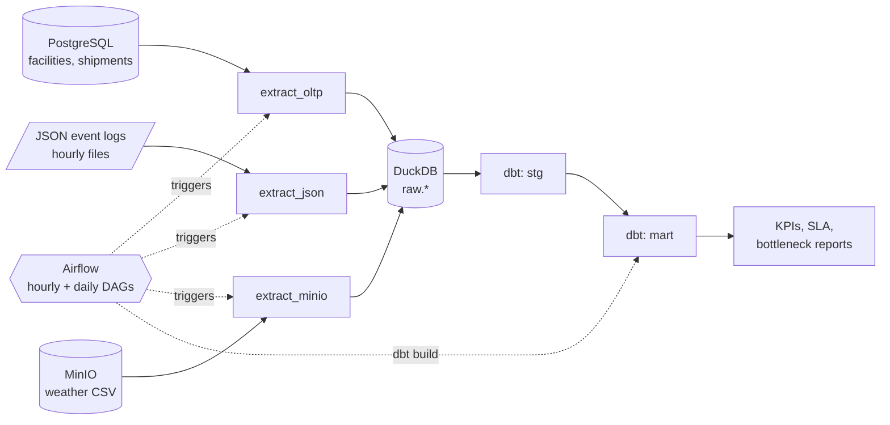

# Architecture

## source types 

- **OLTP (PostgreSQL).** `facilities` and `shipments` are the normalized,
  transactional backbone. Writes are infrequent but consistency matters —
  a shipment without a valid origin facility makes no sense.
- **JSON logs.** `tracking_events` is append-only and semi-structured. Real
  courier systems emit these as scanner pings, and the shape of a "damaged
  package" event isn't the same as a "delivered" event (`courier_notes`
  sometimes present, `facility_id` sometimes null because the scan happened
  in a truck). JSON fits this cleanly; forcing it into a relational schema
  would make the writer awkward.
- **MinIO.** Historical weather is big enough that dbt seeds would be the
  wrong tool (the assignment calls this out explicitly — seeds are for small
  reference data). Object storage also matches how you'd actually receive a
  vendor's CSV dump in practice.

## Extract and load

Everything under `etl/` is a thin wrapper:

| Script | Reads | Writes |
|---|---|---|
| `extract_oltp.py` | PostgreSQL via SQLAlchemy | `raw.facilities`, `raw.shipments` |
| `extract_json.py` | JSON files in `data/raw/events/` | `raw.tracking_events` |
| `extract_minio.py` | `logistics-raw` bucket | `raw.historical_weather_delays` |

`extract_oltp` supports an incremental mode (`INCREMENTAL=1`). It reads
`MAX(created_at)` out of DuckDB and asks Postgres only for rows newer than
that. The hourly DAG uses this; the daily DAG does full replace.

`extract_json` is always incremental — it keeps a small bookkeeping table
`raw._ingested_files` (`file_name PRIMARY KEY, row_count, ingested_at`) and
skips files it's already seen. `source_file` is also stamped onto every row
of `raw.tracking_events`, which is basic provenance but enormously useful
when a downstream test fails and you want to know which file produced the
bad row.

`extract_minio` is full-replace only. The weather file is small enough that
incremental logic would be overengineering.

## Orchestration

Two DAGs, on purpose:

**`hourly_etl_pipeline`** (`@hourly`). Incremental OLTP → incremental JSON →
`dbt build --select tag:hourly`. Designed to be cheap. If a run fails, the
next one will redo the delta anyway (idempotency: a second incremental
extract with no new rows is a no-op, and JSON is deduped by filename).

**`daily_refresh_pipeline`** (`0 2 * * *`). Full OLTP → full JSON refresh →
MinIO → `dbt build --select tag:daily`. The big rebuild, at 02:00 UTC when
nothing else is happening. This is where the heavier mart models live
(SLA aggregations, year-over-year trends — anything that doesn't need
hourly freshness).

Both DAGs gracefully skip the dbt step if `dbt_project/dbt_project.yml`
doesn't exist. This lets Student 1 iterate on the pipeline without waiting
for Student 2's models to be finished.

## Why tags instead of two dbt projects

The assignment wants to see tag-based scheduling, and tags express intent
better than directory structure: a model doesn't _belong_ to a cadence, it
_needs_ a cadence. `config(tags=['hourly'])` on a staging model that powers
a live dashboard and `config(tags=['daily'])` on a rolling-window KPI is a
readable way to encode that.

In the real world this also gives you a knob: if `mart_bottleneck_analysis`
suddenly needs to refresh every hour, you just add the `hourly` tag and the
existing hourly DAG picks it up — no DAG change.

